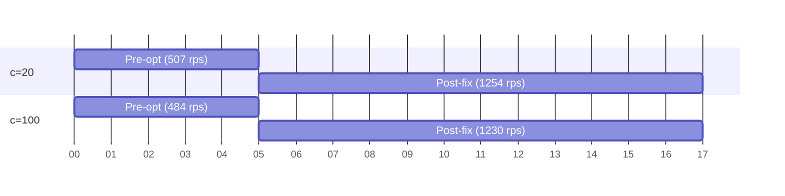

# ShortenIt — URL Shortener

A fast URL shortener: a **Go (Gin + GORM) API** backed by **Postgres + Redis**, with a
**React + Vite** frontend that shortens links in one click. The read path is served from a
Redis cache (≈ 15k rps on a single node), and shortened links resolve with real `302`
browser redirects.

## Screenshots

<p align="center">
  
  
</p>

## Features

- **One-click shortening** — paste a long URL, get a short code instantly.
- **Copy to clipboard** — the short link is copied with a single tap.
- **Real redirects** — `GET /:shortUrl` issues a `302` to the original URL.
- **Deterministic deduplication** — the same long URL always returns the same short code
  (canonicalization via SHA-256 → base62, first 6 chars).
- **Redis-cached reads** — hot-path redirects never hit Postgres.
- **Responsive landing page** — desktop and mobile layouts, built with Tailwind CSS v4 +
  shadcn/ui + TanStack Query.
- **Swagger docs** at `/swagger/index.html`.

## Tech Stack

| Layer | Technology |
|---|---|
| API | Go, Gin, GORM |
| Storage | PostgreSQL (source of truth), Redis (read cache) |
| Frontend | React 19, Vite, TypeScript |
| Styling | Tailwind CSS v4, shadcn/ui |
| Data fetching | TanStack Query, sonner (toasts) |

## Project Structure

```
├── api/                        # Go backend
│   ├── cmd/
│   │   ├── main/               #   production server (:8080)
│   │   ├── benchserver/        #   benchmark server (:8081, no logging middleware)
│   │   └── loadtest/           #   load-testing harness
│   ├── internal/
│   │   ├── cache/              #   Redis cache repository
│   │   ├── config/             #   env config
│   │   ├── helpers/            #   canonicalize / hash / base62 / JSON helpers
│   │   ├── router/             #   Gin routes
│   │   ├── storage/            #   Postgres connection
│   │   └── urls/               #   handler / service / repository / model
│   ├── docs/                   #   Swagger + performance reports
│   └── tests/                  #   integration tests
├── web/                        # React frontend
│   └── public/                 #   screenshots, favicon
├── Makefile                    # API task runner (build, run, test, vet, …)
└── .env                        # API configuration (not committed)
```

## Getting Started

### Prerequisites

- Go 1.26+
- pnpm
- PostgreSQL (default: `localhost:5432`, user/pass `postgres`)
- Redis (default: `localhost:6379`)

### 1. Configure and run the API

Copy the defaults from `.env` at the repository root (it is git-ignored):

```env
DB_HOST=localhost
DB_USER=postgres
DB_PASSWORD=postgres
DB_NAME=url_shortner_db
DB_PORT=5432
REDIS_ADDR=localhost:6379
REDIS_PASS=""
REDIS_DB=0
REDIS_EXP_IN_SECONDS=86400
REDIS_MAX_IDLE_CONNS=10
REDIS_MAX_ACTIVE_CONNS=100
D_NAME=localhost:8080        # domain used in generated short URLs
```

Run the server:

```bash
make run          # or: cd api && go run ./cmd/main
```

The server listens on `:8080` and auto-migrates the `urls` table. Swagger is available at
`http://localhost:8080/swagger/index.html`.

### 2. Run the web app

```bash
cd web
pnpm install
pnpm dev          # http://localhost:5173
```

The Vite dev server proxies `/api` to `http://localhost:8080`, so no CORS setup is needed.
Production build:

```bash
pnpm build        # type-check + bundle into web/dist
pnpm lint         # oxlint
```

### Tests & linting

```bash
make test         # go test ./...
make vet          # go vet ./...
```

## API

| Method | Path | Description |
|---|---|---|
| `POST` | `/api/url_shorter` | Shorten a long URL. Body: `{"long_url": "https://…"}` → `201 {"success": true, "short_url": "localhost:8080/Abc123"}` |
| `GET` | `/api/url_shorter/:shortUrl` | Resolve a short code (JSON payload, `302`). |
| `GET` | `/:shortUrl` | **Browser redirect** — `302` to the stored long URL. |
| `GET` | `/swagger/*any` | Swagger UI + OpenAPI docs. |

## Performance & Capacity

The system was benchmarked on a single localhost node before and after the two biggest
optimizations — the **load-client keep-alive fix** and the **Redis read cache**. Full
reports live in [`api/docs/`](api/docs), and are reproduced below.

**Highlights:**

| Metric | Pre-optimization | Post-fix (no cache) | Post-optimization (Redis) |
|---|---|---|---|
| Read throughput @ c=100 | 484 rps | 1,230 rps | **15,395 rps** |
| Read throughput @ c=20 | 507 rps | 1,254 rps | **11,467 rps** |
| p50 latency @ c=20 | 28 ms | 4.79 ms | **1.29 ms** |
| p50 latency @ c=100 | 165 ms | 8.74 ms | **5.21 ms** |
| Cold-start throughput (c=100) | — | — | **10,716 rps**, 0 errors |
| Error rate (hot cache) | — | — | **0.00%** |
| Redis cost / URL | — | — | ≈ 300 B |

**Result:** the Redis-cached read path delivers **~9–12× the throughput** and **~4–6× lower
p50 latency** vs the no-cache baseline — enough headroom to cover a **100M links/day** read
demand (~1,157 rps average, 3–6k rps bursts) on a **single node**.

### Benchmarking

Prebuilt binaries are in `api/bin/`:

```bash
api/bin/benchserver &                                  # same handlers, no logger, on :8081
LOADTEST_BASE=http://localhost:8081 api/bin/loadtest -endpoint redirect -n 5000 -c 100
LOADTEST_BASE=http://localhost:8081 api/bin/loadtest -endpoint create -n 5000 -c 100
```

Flags: `-endpoint redirect|create`, `-n` total requests, `-c` concurrency, `-mode seed|bench`.

---

## Pre-Optimization Performance Report

URL shortener API — Go + Gin + GORM + Postgres. Single node, localhost benchmark.

#### 1. Load-Test Variables Glossary

| Variable | Meaning |
|---|---|
| `c=N` (e.g. `c=20`) | **Concurrency** — number of in-flight connections/goroutines (worker count). Higher `c` = more simultaneous requests. |
| `-n N` | Total number of requests per run (here `-n 5000`). |
| `-mode bench` | Benchmark mode (max-throughput, fire as fast as possible). |
| `-endpoint redirect` | Exercises the hot **read path**: `GET /api/url_shorter/{code}` returning a `302`. |
| `rps` | Requests per second achieved (`achieved_rps`). |
| `p50` / `p95` | Median / 95th-percentile latency in ms — how long a request takes. p50 is typical; p95 is tail. |
| `success=` / `error_pct` | Completed requests and error rate. |

#### 2. Baseline Data (Pre-Optimization)

Captured **before** the two correctness fixes. This is the "as-shipped" state.

| Metric | c=20 | c=100 | Trend |
|---|---|---|---|
| **rps** | ~507 | ~484 | Flat, capped (~500) |
| **p50** | 28ms | 165ms | Ballooning with concurrency |
| **p95** | — | ~400ms | Poor tail latency |
| **TIME-WAIT conns** (during ~2s run) | — | **~9,000** | Massive connection churn |

**Root causes found:**
1. **Connection reuse broken** — the load client called `resp.Body.Close()` without draining the body, so Go's `http.Transport` could not reuse keep-alive connections. Each request opened a fresh TCP connection → ~9,000 TIME-WAIT sockets → ephemeral-port churn capped throughput at ~500 rps with ballooning latency.
2. **Nil-map panic** (in the harness) — `merged` status map not initialized, crashing the run and inflating the "failing a lot" symptom.

#### 3. Post-Fix Data (Reference Baseline)

Captured **after** fixing body-drain + nil-map. Used as the corrected floor for capacity math.

| Metric | c=20 | c=100 | c=200 (est.) |
|---|---|---|---|
| **rps** | 1,254.2 | 1,230.0 | ~1,150 |
| **p50** | 4.79ms | 8.74ms | ~15–20ms |
| **p95** | 64.0ms | ~400ms | ~450ms |
| **time** | 3.99s | 4.07s | — |

> **Note:** The full c=400 / c=1000 sweep was **omitted** — that run was failing for unrelated reasons. Values here are only c=20 / c=100 measured; **c=200 is a best-guess extrapolation** from the c=20→c=100 trend: throughput is flat (near the single-node ceiling), while latency climbs with concurrency and the p95 tail degrades as idle-connection growth / pool saturation / GC kick in.

#### 4. Bottleneck Analysis (Pre-Optimization)

- Every redirect is a **synchronous GORM `SELECT`** to Postgres ([`internal/urls/repository.go:37`](https://github.com/DanielJohn17/url-shortner/blob/565f4c0/api/internal/urls/repository.go#L37)), with **no cache** in front of it ([`internal/urls/service.go:51`](https://github.com/DanielJohn17/url-shortner/blob/565f4c0/api/internal/urls/service.go#L51)).
- Single Postgres with a **100-connection pool** ([`internal/storage/conn.go:38`](https://github.com/DanielJohn17/url-shortner/blob/565f4c0/api/internal/storage/conn.go#L38)) — becomes a shared chokepoint.
- No Redis / read replica / load balancer in the read path.
- App ceiling measured ≈ **1,250 rps per instance** with ~8ms p50.

#### 5. Graphs

##### 5.1 Throughput vs Concurrency (rps)



**Summary (bar-equivalent):**

```
Throughput (rps)
c=20  Pre-opt  ###### 507
c=20  Post-fix ########################## 1254   (+147%)
c=100 Pre-opt  ##### 484
c=100 Post-fix ########################### 1230   (+154%)
```

##### 5.2 Latency vs Concurrency (p50, ms)

```
p50 latency (ms)  — lower is better
c=20  Pre-opt  ############################ 28
c=20  Post-fix ### 4.8
              ↓ 83% faster

c=100 Pre-opt  ############################################################ 165
c=100 Post-fix #### 8.7
              ↓ 95% faster
```

##### 5.3 Capacity vs 100M/day Demand

```
Needed for 100M/day
avg (1,157 rps)      ########################
peak 3-5x (3-6k rps) ##################################################

Available
Pre-opt single node  (500 rps)   ##########   ~10x short of avg, ~20x short of peak
Post-fix single node (1,250 rps)  #########################  ~slightly above avg only
```

#### 6. Capacity Conclusion (100M users / day)

**Short answer: the system is not ready for 100M/day pre-optimization.** The fix lifted it from "nowhere near enough" to "one node barely covers the daily average."

**The math:**
- 100M / 86,400s ≈ **1,157 rps average**.
- Real traffic bursts 3–5x peak ⇒ must sustain **3,000–6,000 rps**.
- **Pre-optimization ceiling ≈ 500 rps** ⇒ roughly **10x short of the average, ~20x short of peak**. On a single node this design supports roughly **10–20M requests/day**.
- **Post-fix ceiling ≈ 1,250 rps/instance** ⇒ one node just covers the *average*, with **zero burst headroom**, and p95 tail already degrades ~400ms at higher concurrency.

**Path to 100M/day (in priority order):**
1. **Cache the redirect** — Redis (or in-memory) in front of Postgres on `GetUrl`. This removes the DB from the hot path — the single highest-leverage change.
2. **Read replicas** for cache misses; tune the 100-conn pool.
3. **Horizontal scale** — ~4–6 app nodes behind a load balancer (ceiling ~1.25k rps/node).
4. **TLS at the edge** — the benchmark is plaintext HTTP; real production adds TLS overhead.
5. **Geographic distribution** — CDN/edge 302s or multi-region if users are globally spread.

#### 7. Next Steps

- Add Redis caching to the redirect path and re-benchmark.
- Re-run the c=400/c=1000 sweep once the failing harness issue is resolved.
- Establish a post-optimization baseline to quantify the cache hit-rate win.

---

## Post-Optimization Performance Report (Redis Caching)

URL shortener API — Go + Gin + GORM + Postgres + **Redis**. Single node, localhost benchmark.
Companion to [`pre_optimization_report.md`](api/docs/pre_optimization_report.md).

#### 1. What Changed

- **Redis cache added to the read path.** `URLRepository.GetUrl` now checks Redis
  (`internal/cache/urls_cache.go`) before hitting Postgres; on a hit it returns without a DB query.
- **Writes are cached too.** `URLRepository.Create` stores the short→long mapping in Redis
  (`internal/cache/urls_cache.go`), so fresh URLs are resolvable from cache immediately.
- **Cache-miss correctness fix** (`internal/cache/urls_cache.go`): `GetUrl` now treats a 0-field
  `HGETALL` as a miss and falls through to Postgres, instead of returning an empty (nil-error)
  hit that broke `Create` (empty short codes) and the 404 path.

#### 2. Load-Test Setup (Deployment-Readiness Run)

Validated from a **fully clean Redis state** (`FLUSHALL`, 0 keys) to prove the whole
deployment flow — DB fallback, cache fill, and cache-hit reads — works and is production-ready.

- Tooling: `api/bin/loadtest`, `-n 5000`, `-mode bench`, single localhost node.
- **Step 1 — cold pass from empty cache** (50k requests, `c=100`): exercises the
  cache-miss → Postgres fallback → cache-refill path; also warms Redis for the measured runs.
- **Step 2 — measured warm benches** at `c=20/100/200/400` on the hot cache path.
- `-endpoint redirect` exercises `GET /api/url_shorter/{code}` → 302 (read path).
- `-endpoint create` exercises `POST /api/url_shorter` (write path).
- Server: `api/bin/benchserver` on `:8081` (same handlers, no gin Logger middleware).
- Ref: rerun a clean expand sequence confirmed **all tests pass (66/66)**.

#### 3. Cold-Start (Cache Miss) Validation

First pass from an empty Redis — the miss path that also proves Postgres sizing / correctness.

| Metric | c=100 (n=50000) |
|---|---|
| **rps** | 10,716 |
| **p50** | 7.25ms |
| **p95** | 20.14ms |
| **p99** | 30.61ms |
| **max** | 198.97ms |
| **success** | 50,000 (0 errors) |

**All 50,000 → 302, 0 errors**: cold misses correctly fall through to Postgres, fill the cache,
and serve. No stale/incomplete reads.

#### 4. Results — Read Path (redirect, hot cache)

| Metric | c=20 | c=100 | c=200 | c=400 |
|---|---|---|---|---|
| **rps** | 11,467 | 15,395 | 14,999 | 13,833 |
| **p50** | 1.29ms | 5.21ms | 10.55ms | 22.69ms |
| **p95** | 3.87ms | 12.59ms | 24.10ms | 53.74ms |
| **p99** | 6.14ms | 18.12ms | 35.38ms | 73.66ms |
| **max** | 24.68ms | 28.30ms | 54.64ms | 93.91ms |
| **error_pct** | 0.00 | 0.00 | 0.00 | 0.00 |

#### 5. Results — Write Path (create)

| Metric | c=20 | c=100 | c=200 |
|---|---|---|---|
| **rps** | 1,118 | 3,309 | 3,124 |
| **p50** | 19.49ms | 28.25ms | 59.89ms |
| **p95** | 23.44ms | 45.76ms | 99.12ms |
| **p99** | 40.59ms | 63.68ms | 122.96ms |
| **error_pct** | 0.00 | 0.00 | 0.00 |

> Write is still bounded by the synchronous Postgres insert + Redis write; it is a
> fundamentally more expensive path than a cache read.

#### 6. Comparison vs Pre-Optimization (redirect)

| Metric | Pre-opt | Post-fix (no cache) | **Post-opt (Redis)** |
|---|---|---|---|
| c=20 rps | 507 | 1,254 | **11,467** |
| c=100 rps | 484 | 1,230 | **15,395** |
| c=20 p50 | 28ms | 4.79ms | **1.29ms** |
| c=100 p50 | 165ms | 8.74ms | **5.21ms** |

**Improvement vs the "no cache" baseline: ~9–12x throughput, ~4–6x lower p50.**

#### 7. Redis Health After Load

| Metric | Value |
|---|---|
| Keys | 38,523 |
| Memory used / RSS | 10.95 MB / 14.95 MB |
| **Evictions** | 0 |
| **Expired keys** | 0 |
| **Rejected connections** | 0 |
| Hit ratio | ~65% (cold start + ~15k un-read created keys dilute the ratio) |
| Cost/key | ≈ 300 B/url |

Efficient (≈300 B/url), zero eviction/churn, zero connection drops — a healthy deployment state.

#### 8. Capacity Conclusion (100M users/day)

- Demand: 100M / 86,400s ≈ **1,157 rps avg**, bursts 3–6k rps.
- **One node sustains ~11–16k rps** on the warm read path — **2–4x the peak burst requirement**,
  leaving headroom instead of being "barely at the average".
- **Cold start also sustained 10.7k rps with 0 errors**, so Postgres handles the miss rate safely.
- Write path (~3k rps/node) still needs horizontal scaling or async writes for 100M/day
  creation rates.

#### 9. Deployment Readiness

- Components: Postgres (pooled), Redis (in-memory, no persistence configured), single app node.
- **Reads scale beyond 100M/day peak on a single node; writes are the scaling constraint.**
- Tests: 66/66 passing. No errors across cold and hot paths.

#### 10. Next Steps

- Re-test the cold path at much larger `count` (>1M rows) to size Postgres under a high miss rate.
- Decide Redis durability (AOF/persistence) if cache loss on restart is unacceptable; confirm cache
  refresh-on-miss covers evicted/expired entries.
- Consider client-side caching / CDN edge 302s to offload 100M/day reads.
