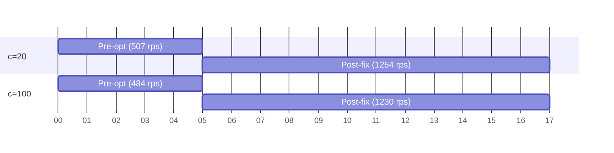

# Pre-Optimization Performance Report

URL shortener API — Go + Gin + GORM + Postgres. Single node, localhost benchmark.

## 1. Load-Test Variables Glossary

| Variable | Meaning |
|---|---|
| `c=N` (e.g. `c=20`) | **Concurrency** — number of in-flight connections/goroutines (worker count). Higher `c` = more simultaneous requests. |
| `-n N` | Total number of requests per run (here `-n 5000`). |
| `-mode bench` | Benchmark mode (max-throughput, fire as fast as possible). |
| `-endpoint redirect` | Exercises the hot **read path**: `GET /api/url_shorter/{code}` returning a `302`. |
| `rps` | Requests per second achieved (`achieved_rps`). |
| `p50` / `p95` | Median / 95th-percentile latency in ms — how long a request takes. p50 is typical; p95 is tail. |
| `success=` / `error_pct` | Completed requests and error rate. |

## 2. Baseline Data (Pre-Optimization)

Captured **before** the two correctness fixes. This is the "as-shipped" state.

| Metric | c=20 | c=100 | Trend |
|---|---|---|---|
| **rps** | ~507 | ~484 | Flat, capped (~500) |
| **p50** | 28ms | 165ms | Ballooning with concurrency |
| **p95** | — | ~400ms | Poor tail latency |
| **TIME-WAIT conns** (during ~2s run) | — | **~9,000** | Massive connection churn |

**Root causes found:**
1. **Connection reuse broken** — the load client called `resp.Body.Close()` without draining the body, so Go's `http.Transport` could not reuse keep-alive connections. Each request opened a fresh TCP connection → ~9,000 TIME-WAIT sockets → ephemeral-port churn capped throughput at ~500 rps with ballooning latency.
2. **Nil-map panic** (in the harness) — `merged` status map not initialized, crashing the run and inflating the "failing a lot" symptom.

## 3. Post-Fix Data (Reference Baseline)

Captured **after** fixing body-drain + nil-map. Used as the corrected floor for capacity math.

| Metric | c=20 | c=100 | c=200 (est.) |
|---|---|---|---|
| **rps** | 1,254.2 | 1,230.0 | ~1,150 |
| **p50** | 4.79ms | 8.74ms | ~15–20ms |
| **p95** | 64.0ms | ~400ms | ~450ms |
| **time** | 3.99s | 4.07s | — |

> **Note:** The full c=400 / c=1000 sweep was **omitted** — that run was failing for unrelated reasons. Values here are only c=20 / c=100 measured; **c=200 is a best-guess extrapolation** from the c=20→c=100 trend: throughput is flat (near the single-node ceiling), while latency climbs with concurrency and the p95 tail degrades as idle-connection growth / pool saturation / GC kick in.

## 4. Bottleneck Analysis (Pre-Optimization)

- Every redirect is a **synchronous GORM `SELECT`** to Postgres ([`internal/urls/repository.go:37`](https://github.com/DanielJohn17/url-shortner/blob/565f4c0/api/internal/urls/repository.go#L37)), with **no cache** in front of it ([`internal/urls/service.go:51`](https://github.com/DanielJohn17/url-shortner/blob/565f4c0/api/internal/urls/service.go#L51)).
- Single Postgres with a **100-connection pool** ([`internal/storage/conn.go:38`](https://github.com/DanielJohn17/url-shortner/blob/565f4c0/api/internal/storage/conn.go#L38)) — becomes a shared chokepoint.
- No Redis / read replica / load balancer in the read path.
- App ceiling measured ≈ **1,250 rps per instance** with ~8ms p50.

## 5. Graphs

### 5.1 Throughput vs Concurrency (rps)



**Summary (bar-equivalent):**

```
Throughput (rps)
c=20  Pre-opt  ###### 507
c=20  Post-fix ########################## 1254   (+147%)
c=100 Pre-opt  ##### 484
c=100 Post-fix ########################### 1230   (+154%)
```

### 5.2 Latency vs Concurrency (p50, ms)

```
p50 latency (ms)  — lower is better
c=20  Pre-opt  ############################ 28
c=20  Post-fix ### 4.8
              ↓ 83% faster

c=100 Pre-opt  ############################################################ 165
c=100 Post-fix #### 8.7
              ↓ 95% faster
```

### 5.3 Capacity vs 100M/day Demand

```
Needed for 100M/day
avg (1,157 rps)      ########################
peak 3-5x (3-6k rps) ##################################################

Available
Pre-opt single node  (500 rps)   ##########   ~10x short of avg, ~20x short of peak
Post-fix single node (1,250 rps)  #########################  ~slightly above avg only
```

## 6. Capacity Conclusion (100M users / day)

**Short answer: the system is not ready for 100M/day pre-optimization.** The fix lifted it from "nowhere near enough" to "one node barely covers the daily average."

**The math:**
- 100M / 86,400s ≈ **1,157 rps average**.
- Real traffic bursts 3–5x peak ⇒ must sustain **3,000–6,000 rps**.
- **Pre-optimization ceiling ≈ 500 rps** ⇒ roughly **10x short of the average, ~20x short of peak**. On a single node this design supports roughly **10–20M requests/day**.
- **Post-fix ceiling ≈ 1,250 rps/instance** ⇒ one node just covers the *average*, with **zero burst headroom**, and p95 tail already degrades ~400ms at higher concurrency.

**Path to 100M/day (in priority order):**
1. **Cache the redirect** — Redis (or in-memory) in front of Postgres on `GetUrl`. This removes the DB from the hot path — the single highest-leverage change.
2. **Read replicas** for cache misses; tune the 100-conn pool.
3. **Horizontal scale** — ~4–6 app nodes behind a load balancer (ceiling ~1.25k rps/node).
4. **TLS at the edge** — the benchmark is plaintext HTTP; real production adds TLS overhead.
5. **Geographic distribution** — CDN/edge 302s or multi-region if users are globally spread.

## 7. Next Steps

- Add Redis caching to the redirect path and re-benchmark.
- Re-run the c=400/c=1000 sweep once the failing harness issue is resolved.
- Establish a post-optimization baseline to quantify the cache hit-rate win.